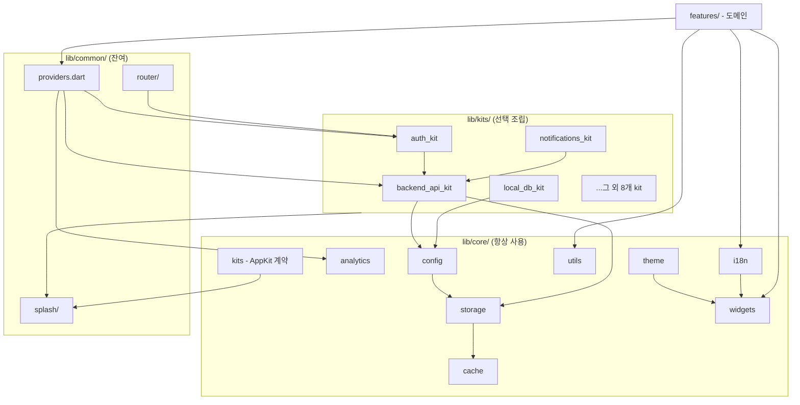

# Architecture Conventions

---

## FeatureKit 아키텍처

앱의 선택적 기능(네트워크/인증/DB/알림/차트 등)은 모두 **FeatureKit**으로 캡슐화된다.
`main.dart`의 `AppKits.install([...])`로 필요한 kit만 조립한다. 상세: [kits.md](./kits.md).

```dart
// sumtally류 로컬 앱
await AppKits.install([
  LocalDbKit(database: () => AppDatabase()),
  OnboardingKit(prefs: prefs, steps: [...]),
  NavShellKit(tabs: [...]),
  ChartsKit(),
]);

// rny류 알림 앱
await AppKits.install([
  LocalDbKit(database: () => AppDatabase()),
  NotificationsKit(service: LocalScheduledAlertService()),
  BackgroundKit(scheduler: WorkmanagerTaskScheduler(), callbackDispatcher: bgDispatcher),
  AdsKit(config: AdConfig(...)),
  ChartsKit(),
]);

// 백엔드+인증 앱
await AppKits.install([
  BackendApiKit(),
  AuthKit(),
]);
```

**디렉토리 구조**:
- `lib/core/` — 모든 앱이 항상 쓰는 것 (theme/widgets/utils/i18n/storage 등)
- `lib/kits/` — 선택적 FeatureKit (12개)
- `lib/features/` — 앱 고유 화면

---

## MVVM 패턴

### 구조

```
features/{domain}/
├── {domain}_screen.dart       # View — ConsumerWidget, UI만
├── {domain}_view_model.dart   # ViewModel — StateNotifier, 로직만
└── models/                    # Model — 도메인 데이터
```

### 역할 분리

| 레이어 | 담당 | 금지 |
|--------|------|------|
| **Screen** | 위젯 트리 빌드, 사용자 입력 수신, `ref.watch/read` | 비즈니스 로직, API 호출, 상태 변환 |
| **ViewModel** | 상태 관리, API 호출, 에러 처리, 비즈니스 로직 | BuildContext, Widget, 화면 네비게이션 |
| **Model** | 데이터 구조, fromJson/toJson, 도메인 규칙 | UI 코드, Provider, 네트워크 호출 |

### 상태 클래스

```dart
class ExpenseListState {
  final List<Expense> items;
  final bool isLoading;
  final String? error;

  const ExpenseListState({
    this.items = const [],
    this.isLoading = false,
    this.error,
  });

  ExpenseListState copyWith({...}) => ExpenseListState(...);
}
```

- 상태는 **불변(immutable)**
- `copyWith`로만 새 상태 생성
- 에러는 **에러 코드** 저장 → 화면에서 `S.of(context)`로 번역

### Provider 정의

```dart
// 전역 서비스 → lib/common/providers.dart (점진 이관 중)
final authServiceProvider = Provider<AuthService>(...);

// Kit이 기여하는 서비스 → lib/kits/{kit}/{kit}.dart 내부
final scheduledAlertServiceProvider = Provider<ScheduledAlertService>(...);

// 화면별 ViewModel → features/{domain}/{domain}_view_model.dart 하단
final expenseListProvider = StateNotifierProvider.autoDispose<
    ExpenseListViewModel, ExpenseListState>(...);
```

- 전역 서비스: `Provider` (앱 생명주기)
- 화면별 ViewModel: `StateNotifierProvider.autoDispose` (화면 이탈 시 정리)

---

## 모듈 의존 방향

FeatureKit 리팩터 이후 구조는 **3층**:
- `lib/core/` — 모든 앱이 항상 쓰는 기반 (9개 모듈)
- `lib/kits/` — 선택 가능한 FeatureKit (12개)
- `lib/common/` — 점진 이관 중인 잔여 모듈 (`providers.dart`, `router/`, `splash/`)



> 다이어그램은 주요 경계만 표시한 **샘플**이다. 특히 `features`는 그림에 그려진 몇 개 외에도 **`core/*` 전체**(theme/config/storage/cache 등)에 직접 접근할 수 있다 — MVVM UI/VM은 core 모듈을 자유롭게 사용한다.
>
> `BootStep` 계약은 현재 `common/splash/boot_step.dart`에 있어 `core/kits` 및 모든 kit이 이 파일을 import 한다. 이관 예정(→ `core/kits`)이며, 그때까지는 common이 "뿌리에 가까운 의존 대상"으로 유지된다.

### 규칙

1. **core는 kits/features를 모른다** (단방향) — `common/splash/boot_step.dart`는 이관 예정인 예외로, 위 노트 참조.
2. **kits는 features를 모른다** (단방향)
3. **kits끼리는 `requires` 선언으로만 의존** (예: auth_kit → backend_api_kit)
4. **common/**은 리팩터 잔여물 — 점진적으로 core/kits로 이관
5. **순환 의존 금지.** 불가피 시 Provider 타입 명시 선언으로 지연 해결 (예: `apiClientProvider` ↔ `authServiceProvider`)
6. **common → features 의존 예외**: `common/router/app_router.dart`는 기본 features 2개(`home`, `settings`)를 참조한다. 템플릿이 기본 제공하는 스텁을 라우터가 알아야 하기 때문. 파생 레포 생성 후 해당 import를 앱별 features로 교체/제거 가능.

---

## 에러 처리 전략

### 네트워크 에러

```
API 호출 → DioException → ErrorInterceptor → ApiException
         → 401 → AuthInterceptor → 자동 refresh → 재시도
```

- `ApiException`은 **에러 코드 기반** (한국어 메시지 미포함)
- 화면에서 에러 코드 → `S.of(context)`로 사용자 메시지 변환
- 서버가 `{data: null, error: {code, message}}` 반환 시 서버 메시지 우선 표시

### 화면별 에러 표시

| 상황 | 표시 방법 |
|------|-----------|
| 폼 검증 실패 | inline 에러 텍스트 (TextField 아래) |
| API 에러 (목록) | `ErrorView` + 재시도 버튼 |
| API 에러 (단건 액션) | `AppSnackBar.show(type: error)` |
| 네트워크 끊김 | `AppSnackBar` 또는 전체 화면 에러 |

---

## 캐시 전략

### Repository 패턴

```dart
class ExpenseRepository {
  final ApiClient _api;
  final CachedRepository _cache;

  Future<Expense> getById(int id) => _cache.fetch(
    key: 'expense_$id',
    ttl: Duration(minutes: 5),
    policy: CachePolicy.cacheFirst,
    fetcher: () => _api.get(...),
    fromJson: (json) => Expense.fromJson(jsonDecode(json)),
    toJson: (e) => jsonEncode(e.toJson()),
  );
}
```

### CUD 후 캐시 무효화

```dart
Future<void> create(ExpenseCreateRequest req) async {
  await _api.post('/expenses', data: req.toJson());
  await _cache.invalidateByPrefix('expense_');  // 관련 캐시 전체 삭제
}
```

---

## 인증 흐름

```
앱 시작 → checkAuthStatus()
  ├─ 토큰 없음 → unauthenticated → /login
  ├─ access token 유효 → authenticated → /home
  └─ access token 만료 → refreshToken()
       ├─ 성공 → authenticated → /home
       └─ 실패 → unauthenticated → /login

API 호출 중 401 → AuthInterceptor
  ├─ 자동 refresh → 재시도
  └─ refresh 실패 → signOut → /login
```

- 인증 상태 변경 → `AuthStateNotifier` → GoRouter `refreshListenable` → 자동 리다이렉트
- auth 엔드포인트는 `postRaw` (skipAuth 플래그) 사용 → AuthInterceptor 건너뜀
- withdraw는 인증 필요 → 일반 `post` 사용
