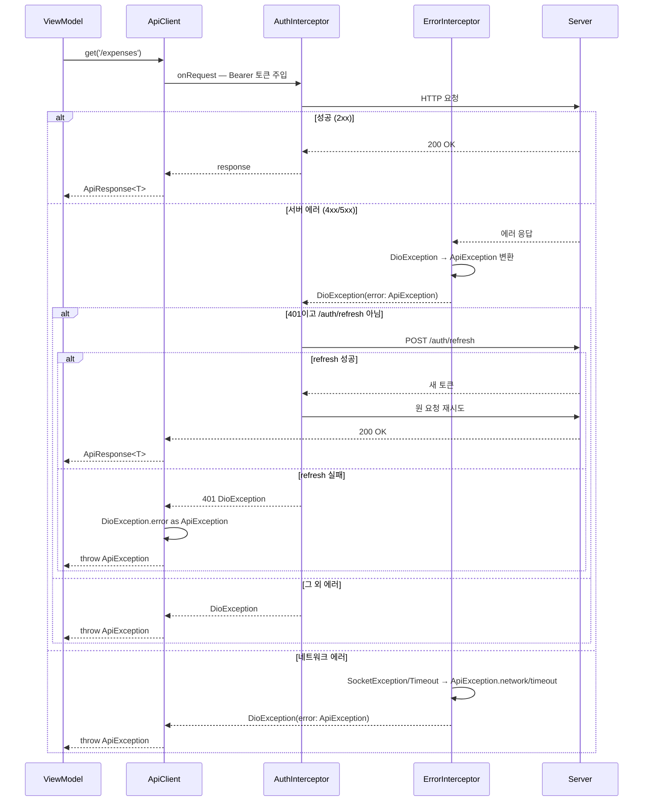

# 에러 핸들링

네트워크 요청에서 발생하는 에러는 `ErrorInterceptor` → `AuthInterceptor` → `ApiClient` → ViewModel 순으로 처리된다. 각 레이어가 명확한 책임을 가지고 있어 ViewModel은 항상 `ApiException` 하나만 처리하면 된다.

---

## 전체 흐름



---

## 레이어별 책임

### 1. ErrorInterceptor — DioException → ApiException 변환

모든 에러의 **첫 번째 관문**. `DioException`을 `ApiException`으로 변환해 `error` 필드에 담아 다음 인터셉터로 전달한다.

**변환 규칙:**

| 상황 | 변환 결과 |
|------|----------|
| 서버가 `{error: {code, message}}` 반환 | `ApiException.fromApiError()` — 서버 code/message 그대로 |
| 연결/수신/송신 타임아웃 | `ApiException.timeout()` — code: `TIMEOUT` |
| 연결 오류, SocketException | `ApiException.network()` — code: `NETWORK_ERROR` |
| 그 외 | `ApiException.unknown()` — code: `UNKNOWN_ERROR` |

### 2. AuthInterceptor — 토큰 주입 + 401 자동 갱신

`QueuedInterceptor`를 상속해 요청을 **순차 처리**한다. 동시 요청이 여러 개 401을 받아도 refresh는 1회만 실행된다.

**onRequest — 토큰 주입:**
- `extra['skipAuth'] == true`이면 헤더 주입 건너뜀 (`postRaw()` 전용)
- 토큰이 있으면 `Authorization: Bearer {accessToken}` 헤더 추가

**onError — 401 자동 갱신:**

```
401 응답 수신
├── skipAuth 요청이거나 /auth/refresh 자체가 401이면 → 그대로 전파 (무한루프 방지)
└── 일반 요청 401
    ├── onTokenRefresh() 호출 (AuthKit이 주입한 콜백)
    ├── 성공 → 새 토큰으로 원 요청 재시도 → resolve
    └── 실패 → 원래 401 DioException 그대로 전파 → ApiClient에서 ApiException throw
```

refresh 실패 시 재시도하거나 별도 에러로 감싸지 않는다. ViewModel이 `isUnauthorized`를 확인해 `signOut()` 여부를 결정한다.

### 3. ApiClient — ApiException throw

`DioException`의 `error` 필드에서 `ApiException`을 꺼내 throw한다. `ErrorInterceptor`가 변환하지 못한 경우에만 `ApiException.unknown()`을 throw한다.

```dart
on DioException catch (e) {
  throw e.error is ApiException ? e.error! : ApiException.unknown();
}
```

### 4. ViewModel — 에러 처리

ViewModel은 항상 `ApiException`만 처리한다. raw `DioException`이나 `SocketException`은 올라오지 않는다.

```dart
Future<void> loadExpenses() async {
  state = state.copyWith(isLoading: true, error: null);
  try {
    final response = await apiClient.get(
      '/expenses',
      fromData: Expense.fromJson,
    );
    state = state.copyWith(isLoading: false, expenses: response.data!);
  } on ApiException catch (e) {
    state = state.copyWith(isLoading: false, error: e.code);
  } catch (e) {
    // ApiException으로 변환되지 않은 예외 (보통 발생하지 않음)
    state = state.copyWith(isLoading: false, error: 'UNKNOWN_ERROR');
  }
}
```

---

## 에러 케이스별 처리 패턴

### 인증 만료 — 자동 처리

토큰 만료는 `AuthInterceptor`가 자동으로 갱신 후 재시도한다. ViewModel은 신경 쓰지 않아도 된다.

refresh 자체가 실패하면 `isUnauthorized`가 `true`인 `ApiException`이 전달된다. `AuthKit`이 이를 감지해 자동 로그아웃한다.

### 네트워크 없음

```dart
on ApiException catch (e) {
  if (e.code == 'NETWORK_ERROR' || e.code == 'TIMEOUT') {
    state = state.copyWith(error: '네트워크를 확인해주세요');
  }
}
```

### 입력 검증 실패

서버가 `VALIDATION_ERROR`와 함께 `details` 필드에 실패 필드 정보를 반환한다.

```dart
on ApiException catch (e) {
  if (e.isValidationError) {
    final field = e.details?['field'] as String?;
    // 특정 필드 에러 표시
  }
}
```

### UI 안전 노출 — safeErrorCode / safeErrorMessage

에러 코드를 UI에 노출할 때는 `safeErrorCode` / `safeErrorMessage`를 사용해 raw exception이 노출되지 않도록 한다. 자세한 내용은 [API Contract — safeErrorCode](api-contract.md#safeerrorcode--safeerrormessage)를 참고.

---

## 인터셉터 실행 순서

`ApiClient` 생성자에서 인터셉터가 등록된 순서가 곧 실행 순서다.

```dart
_dio.interceptors.addAll([
  AuthInterceptor(...),   // 1번 — 토큰 주입, 401 갱신
  ErrorInterceptor(),     // 2번 — DioException → ApiException 변환
  LoggingInterceptor(),   // 3번 — 요청/응답 로깅 (debug only)
]);
```

**onRequest**: 1 → 2 → 3 순으로 실행  
**onResponse**: 3 → 2 → 1 순으로 실행  
**onError**: 3 → 2 → 1 순으로 실행

> `ErrorInterceptor`(2번)가 `onError`에서 `DioException.error`에 `ApiException`을 담아 전달하면, `AuthInterceptor`(1번)가 401 여부를 판단해 refresh를 시도한다.
